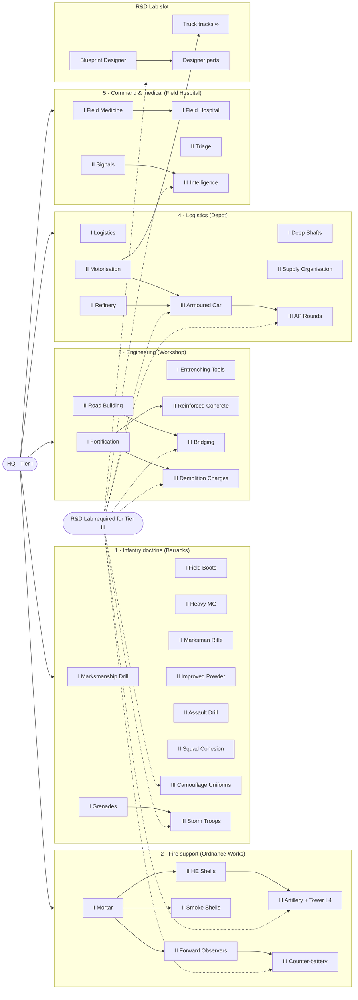

# Dot War: design decisions (after patch 0.2)

Answers to the questions in `GAME_DESIGN.md` section 12, plus the new units, buildings and rules
agreed in the same session (28 September 2026). Format follows section 13: number changes, rule
changes, and new things with the fields the engine needs.

Values marked **(proposed)** were not discussed individually. They are starting points to tune in
play-testing. Everything else was decided explicitly.

## Direction

| Question | Decision |
| --- | --- |
| Era and tone | Grounded, starting in WW2: riflemen, trucks, mortars, bunkers. The game is a WW2-and-beyond sim: later research moves soldiers' kit into the Cold War and modern eras (section K). Drones and EMP arrive late. |
| Mode | Single-player skirmish against the AI first; multiplayer is the long-term goal. |
| Sides | Symmetric. Everyone shares one tech tree; the blueprint designer creates the differences. Factions (section K) change looks only. |
| Player focus | An equal mix of tactics (squads, terrain, morale) and strategy (economy, logistics, tech). |

---

## 0. Findings from reading the code

- **Stress math in section 12 Q9 is wrong.** In `fireBullet`, every shot aimed at a unit adds the
  full `suppress` value, hit or miss. One Machine Gunner produces about 0.19 stress/s. With the
  0.09/s decay it suppresses a target in about 6 s and panics it in about 9 s, not about 3 s.
- **At the old 0.09/s decay, lone Riflemen (0.053/s), Musketeers (0.038/s) and Snipers
  (0.071/s) can never suppress anyone.** Only MGs and mortars could. Fixed by Q9 below.
- **Elevation is already relative** (`dh` = shooter height + tower − target height), but the
  bonus hits its cap at 18–20 m. On maps running from 15 m to 270 m, that makes it almost on/off.
  Fixed by Q8 below.
- **"Controls fixed, do not remap" was a doc rule only.** Nothing in the code needs it. Replaced
  by the new layout in section 9 below.

---

## Opening and tempo

- **Q1:** Rule change. Rifling starts researched for every player. Remove it from the research
  list, or mark it done at init.
- **Q2:** Rule change. First raid time = the enemy's walking time from its base to the player's
  HQ, plus 300 game s of build-up. Scale the raid interval the same way.
- **Q3:** Target about 1-hour matches. Maps become **5–6× longer per side** (about 12–14.4 km).
  - Engine constraint for 0.7: **keep 12 m cells and simulate in chunks** (section G, #10).
    Coarser cells were rejected because they break trench segments, building footprints and the
    forest sight rule.
- **Q15:** Remove the Musketeer.
  - Start: **6 Riflemen and 4 Workers.**
  - The HQ trains Riflemen and Workers.

## Economy

- **Q4:** New **Worker** unit (section A). Soldiers can still work, but count as 0.5 of a worker
  for the harvest rate.
- **Q5:** Keep the harvest rates. Big maps get more metal deposits, placed so they are contested.
- **Q6:** Sulfur sinks:
  - Grenades (section C).
  - Artillery and drones later.
  - Infantry rifle and MG ammo stays **free**; no ammo resource for small arms.
- **Q7:** Fuel is a stock carried by each vehicle (a tank). Vehicles refuel at a Depot. Trucks can
  refuel other vehicles. No per-second oil drain from the stockpile.
- **Q18:** Supply cap.
  - Starts at **30**, **+10 per Depot**, no maximum.
  - Supply per unit: Worker 1, Rifleman 1, MG 1, Sniper 1, Medic 1, Mortar 2, Truck 2.

## Combat

- **Q8:** Hybrid elevation.
  - Range multiplier: `1 + 0.04 * sqrt(dh)` for `dh > 0`, capped at **+50%** (about +20% at
    25 m, +40% at 100 m, cap at 156 m).
    - Uphill: `1 - 0.03 * sqrt(|dh|)`, floor **−20%** (proposed).
  - Damage and accuracy use steepness `s = dh / max(d, 20)`, so height matters most at close range:
    - Damage: `1 + clamp(0.5 * s, -0.10, +0.25)` (proposed constants).
    - Hit chance: `1 + clamp(0.4 * s, -0.10, +0.20)` (proposed constants).
  - Example: 20 m above a target 50 m away gives about +20% damage; the same 20 m at 300 m
    gives about +3%.
- **Q9:** Stress decay 0.09 → **0.06/s**. Thresholds unchanged (suppressed 0.6, panic 0.95).
  - Resulting times to suppress:

    | Attackers | Time to suppressed |
    | --- | --- |
    | 1 MG | about 4.5 s |
    | 2 MGs | about 2 s |
    | 3 Riflemen | about 6 s |
    | 2 Riflemen | about 13 s |
    | 1 Rifleman | never |

- **Q10:** Retreat order:
  - Ignores the 0.6 suppression speed penalty.
  - Stress decays 2× faster (0.12/s) while retreating.
  - Units can still panic.
- **Q11:** Moving-fire accuracy 0.6 → **0.35**. Machine Gunners **cannot fire while moving**.
- **Q12:** Snipers take **half stress** and **never panic**. They can still be suppressed.
- **Q13:** Keep full mortar friendly fire.
- **Q14:** Healing, three sources:
  - HQ regeneration for everyone by default.
  - Medic and Field Hospital, each unlocked by research. Numbers in sections A and B.

## Units and structures

- **Q16:** The Truck is the first vehicle (section A), in patch 0.5 of `IMPLEMENTATION_PLAN.md`.
  The armoured car follows in 0.8.
- **Q17:** Blueprint designer, section D.
- **Q19:** New Scout Tower **level 4** for artillery (section B).
- **Q20:**
  - The HQ can be garrisoned as a last stand: **6 infantry**, who fire from it.
  - New **Bunker** building (section B).
  - Barracks and other buildings stay non-garrisonable.
- **Q21:** Trenches, barricades and wire are drawn as lines by holding the mouse. Details in
  section B.
  - Infantry dig them over time; Workers dig 1.5× faster.
  - They cost resources and are deliberately expensive, so they go where they matter.
- **Q22:** Neutral guards:
  - Patrol a route that never enters base locations.
  - Chase intruders up to about 150 m (proposed), then walk back and slowly heal.
  - New neutral **villages with civilians** that idle in their village. Civilians can be hurt
    and flee from nearby fighting. Hurting them has no score or diplomacy effect.

## AI

- **Q23:** Stays scripted, with passive income, for now. Target for later: the AI plays by the
  same economic rules as the player.
- **Q24:** Raid logic:
  1. Probe the player's towers first.
  2. If a tower falls and no large threat is near the raiders, move on to the weakest outpost
     that lies towards the player's HQ.
  3. Ignore outposts unrelated to the main base.
  4. Continue towards the HQ.

## Victory

- **Q25:** Keep as is. Only HQ destruction ends the game.

---

## 9. Controls (replaces section 9)

WASD now pans the camera. The old rule "fixed, do not remap" is dropped.

| Key | Action |
| --- | --- |
| W A S D | pan camera |
| Right-click | smart command: ground = move, enemy = attack, own tower/bunker/HQ = garrison, camp/mine = work, truck = board |
| F | attack-move |
| R | defend position |
| G | retreat |
| X | stop |
| K | fill trench (Workers only, proposed) |
| E | enter: work at a camp or mine, garrison a tower, bunker or HQ, board a truck |
| Q | exit: unload a truck, tower, bunker or HQ (replaces U) |
| T | upgrade tower (was G) |
| Z X C V | train from a selected factory (was Q W E R T); Tab flips to the next page when a factory has more than 4 blueprints |
| B | build menu (sub-keys unchanged: L, M, C, O, T; new buildings get free letters) |
| N | research overview: every research slot in one panel |
| H | jump to HQ |
| Shift | queue orders |
| Ctrl+1..9 | create or replace squadron (section E); with nothing selected, clears it |
| 1..9 | select squadron; double-tap jumps the camera to it |
| Minimap click | jump camera |
| Middle mouse / wheel | pan / zoom |
| Space | pause |
| , and . | change speed |
| F1 | help |

Line tools (trench, barricade, wire): pick from the build menu, then hold the mouse and drag to
draw.

---

## A. New units

### Worker
| Field | Value |
| --- | --- |
| Shape | circle, with its own logo |
| HP / armor | 40 / none |
| Speed / vision | 50 / 120 |
| Cost / train time | 25 wood / 8 s |
| Research | none |
| Weapon | none |
| Supply | 1 |
| Trained at | HQ |

Role: harvesting. It digs line defences 1.5× faster than soldiers. In patch 0.4 it visibly
carries loads.

### Medic
| Field | Value |
| --- | --- |
| Shape | circle |
| HP / armor | 50 / none |
| Speed / vision | 50 / 140 (proposed) |
| Cost / train time | 20 wood, 15 metal / 10 s (proposed) |
| Research | Field Medicine |
| Weapon | none |
| Heals | one unit at a time, 4 HP/s, within 40 m |
| Supply | 1 |
| Trained at | Barracks |

Role: follows a squad and heals the wounded.

### Truck (rectangle)
| Field | Value |
| --- | --- |
| HP / armor | 150 / light |
| Speed | 110, ×1.5 on roads |
| Vision | 150 |
| Cost | 40 wood, 30 metal, 5 rubber |
| Train time | 18 s (proposed) |
| Research | Motorisation |
| Weapon | none |
| Supply | 2 |
| Built at | Workshop |
| Fuel tank | about 6 km of road driving |

Seats and passengers:
- 6 seats. A circle takes 1 seat and a square (mortar crew) takes 2.
- Passengers are hidden and cannot fire.
- The truck shows a passenger count on its back, e.g. "x2 ○".

Upgrades: **infinitely upgradeable** at the R&D Lab, on three tracks.

| Track | Effect per level |
| --- | --- |
| Armour | +15% HP; at level 5 the player may convert to heavy armour (see below) |
| Engine | +8% speed |
| Fuel tank | +20% tank |

- Each level costs **1.5× the previous level**. Research time stays the same.
- Base level cost (proposed): 20 wood, 40 metal, 40 s.
- **Heavy conversion:** at Armour level 5 the player can choose to convert the truck blueprint to
  heavy armour. Doing so removes all Engine speed bonus gained so far, so the truck is back to base
  speed. Engine levels researched after the conversion add speed again as normal.
- **Truck price grows about 10% per upgrade level** (all tracks counted, proposed), so an
  upgraded truck costs more to build than a base one.
- Trucks already in the field can be **retrofitted at a Workshop** to the latest blueprint. The
  price is 40% of the difference between the truck's current build price and the latest one, so a
  retrofit is always cheaper than building a new truck.
- This is a deliberate exception to the "blueprints, not upgrades" pillar, which still holds for
  every other unit.

## B. New buildings

All sizes, HP, costs and times marked (proposed) need a play-test pass.

| Building | Size | HP | Cost | Build time | Role |
| --- | --- | --- | --- | --- | --- |
| Workshop | 56×44 (p) | 700 (p) | 80 wood, 60 metal (p) | 40 s (p) | builds vehicles, repairs vehicles, retrofits trucks |
| Depot | 48×40 (p) | 500 (p) | 80 wood, 40 metal (p) | 30 s (p) | +10 supply, stores fuel, refuels vehicles within 60 m |
| R&D Lab | 52×44 (p) | 600 (p) | 100 wood, 80 metal (p) | 45 s (p) | advanced research, truck upgrades, blueprint designer; one research at a time |
| Bunker | 32×32 | 1200 | 120 wood, 90 metal | 45 s | 4 infantry + 1 MG slot; occupants +10 accuracy; no height bonus; needs Fortification |
| Field Hospital | 48×40 | 500 | 80 wood, 40 metal | 35 s (p) | heals all friendly infantry within 120 m at 1.5 HP/s; needs Field Hospital research |

The HQ keeps the basic research list, trains Riflemen and Workers, holds 6 infantry as a last
stand, and heals friendly units within 150 m at 0.5 HP/s.

### Scout Tower level 4
| Infantry | Heavy | Height added | HP | Vision | Upgrade cost | Time | Requires |
| --- | --- | --- | --- | --- | --- | --- | --- |
| 6 | 1 (mortar or artillery) | 28 m | 1200 | 320 | 150 wood, 120 metal | 40 s | Artillery research |

### Line defences
Drawn as lines by dragging. Costs are per 10 m segment. Soldiers dig at 15 s per 10 m each;
Workers dig 1.5× faster.

| Type | Cost per 10 m | Effect on holders | Effect on crossers |
| --- | --- | --- | --- |
| Trench | 30 wood | −40% chance to be hit, half stress | ×0.4 speed for enemies and friendly vehicles |
| Barricade | 30 wood, 15 metal | cover 0.7 | blocks vehicles; infantry ×0.5 |
| Wire | 20 metal | no cover, does not block fire | infantry ×0.25 |

## C. New research

> Where each item is researched, its tier and its prerequisites are set by the tech tree in
> section F. Section F takes precedence over the "Where" column below.

| Item | Where | Cost | Time | Requires | Effect |
| --- | --- | --- | --- | --- | --- |
| Grenades | HQ | 30 metal, 40 sulfur | 40 s (p) | none | see below |
| Field Medicine | HQ | 40 wood, 40 metal (p) | 40 s (p) | none | unlocks Medic |
| Field Hospital | HQ | 60 wood, 50 metal (p) | 45 s (p) | Field Medicine (p) | unlocks Field Hospital |
| Fortification | HQ | 60 wood, 60 metal (p) | 45 s (p) | none | unlocks Bunker, barricade, wire |
| Motorisation | R&D Lab | 60 wood, 80 metal, 10 rubber (p) | 50 s (p) | none | unlocks Truck |
| Artillery | R&D Lab | TBD | TBD | Mortar | unlocks artillery part and tower level 4 |
| Truck upgrade tracks | R&D Lab | base 20 wood, 40 metal (p), ×1.5 per level | 40 s, constant | Motorisation | see Truck |

Grenades, for Riflemen:

| Field | Value |
| --- | --- |
| Range | 35 |
| Damage / type | 45 / explosive |
| Splash | 18 |
| Ammo | 1 sulfur per throw |
| Cooldown | 20 s |
| Use | thrown automatically at enemies in trenches or bunkers, or by order |

Rifling and the Musketeer are removed from the list.

## D. Blueprint designer (patch 0.8 in `IMPLEMENTATION_PLAN.md`)

- Chassis at launch: infantry (circle), crew weapon (square), truck (rectangle), armoured car
  (triangle).
- Weapons at launch: rifle, MG, sniper rifle, mortar, RPG (ap), artillery, EMP.
  - EMP disables vehicles and drones for a few seconds and does no damage.
- Armour tiers: none, light, heavy. These match the existing `ARMOR_MULT` table.
- Extras:

  | Extra | Effect |
  | --- | --- |
  | Radio | counts as a spotter for mortars and artillery, with +50% vision range |
  | Binoculars | +25% vision |
  | Smoke | one-use, blocks sight for 15 s |
  | Camouflage | harder to see in forest |

- Balance model: **weight budget.**
  - Each chassis has a weight limit, and weapons, armour and extras use weight.
  - Heavier designs are slower and cost more.
  - Cost = sum of parts × chassis factor.
- Unlocks:
  - The designer opens at the R&D Lab.
  - **Each part has its own research.**

---

## E. Squadrons

Squadrons replace the old control groups. Squad behaviour is a new system in `game.js`: a
squadron object that turns one order into per-unit slots, ranks and shared targets.

### Forming and membership

- **Ctrl+number** with 2–12 units selected makes them squadron N, replacing whatever squadron N
  was before. Selections outside 2–12 are refused with a toast (proposed).
- **Number** selects the squadron. **Double-tapping** the number jumps the camera to it.
- **Ctrl+number with nothing selected** clears squadron N.
- A unit belongs to **one squadron at most**. Putting it into another squadron removes it from
  the first.
- There is no add-to-squadron key. To change members, rebuild the squadron.
- Any unit type can join: combat infantry, mortar crews, trucks and vehicles, Workers, Medics.
- Members **always act as a squad**. Box-selecting some of them and giving an order still moves
  the whole squadron in formation.
- **Auto-disband** when only one member is left. The survivor becomes a normal unit and the number
  is freed.
- **Reinforcement:** setting a factory's rally point on a squad member makes new units from that
  factory join the squadron, up to 12.

### Per-squadron toggles (squad panel)

| Toggle | Options | Default |
| --- | --- | --- |
| Movement | `>` everyone moves at the slowest member's speed · `>>` each at own speed, regroup at destination | `>` |
| Spacing | tight (15 m) · loose (25 m) | loose |
| Contact | react: whole squad halts and faces the enemy · keep moving: members fire on the move at 0.35 accuracy | react |

### Movement and formation

- **Travel shape is automatic:**
  - a 2-wide column on roads and narrow passes;
  - lines on open ground;
  - a line facing the destination on arrival.
- **Plain right-click:** the line faces the direction of travel.
- **Right-drag:** sets the width and facing of the arrival line.
- **Ranks by range**, both on arrival and in combat:
  1. front: short-range units (Riflemen);
  2. second rank: long-range units (MG, Sniper);
  3. rear, at a safe distance: mortars;
  4. centre/rear: Medics and Workers;
  5. behind the last rank: the truck.

### Combat

- **Targets:**
  - Riflemen and MGs share the squad's target.
  - Snipers pick their own targets.
  - Mortars shell whatever the squad is fighting.
- **Morale:**
  - Members within 40 m of a squadmate (proposed) lose stress at **0.08/s** instead of 0.06.
  - A panicking member flees **towards the squad's centre**, not only away from fire.
- **Retreat (G): fighting withdrawal.**
  - Rear ranks fall back first while the front line covers them, then the front line follows.
  - The Q10 retreat bonuses apply: no suppression slowdown, 2× stress decay.

### Support members

- **Truck, long moves** (over 600 m, proposed): the squad boards, drives, unloads and forms up at
  the destination.
- **Truck, short moves:** it follows behind the last rank.
- **Medics** heal squadmates first.
- **Workers** can be ordered to dig a trench line in front of the squad's current position.

### UI

- The squadron number is drawn on each member.
- A squadron bar at the screen edge shows squadrons 1–9 with size, total health and average
  stress.
- The squad panel holds the three toggles above.

---

## F. Tech tree (replaces GAME_DESIGN.md section 6)

### Rules

- **Five branches, three tiers each.**
- **Where each tier is researched:**
  - **Tier I:** at the **HQ**.
  - **Tier II:** at the **branch building** (see the list below).
  - **Tier III:** at the branch building, and only once the player owns an **R&D Lab**.
- **Research slots:** **one slot per building type**, so up to seven research items can run in
  parallel: HQ, the five branch building types, and the R&D Lab. Building a second Barracks does
  not add a second Infantry slot.
- **The early game is slow on purpose.** The HQ is the only research building at the start, so
  the opening is about infantry. Road Building sits in tier II.
- **Two kinds of effect:**

  | Tag | Kind | Applies to |
  | --- | --- | --- |
  | **B** | Blueprint research: changes unit stats | units produced afterwards only ("blueprints, not upgrades") |
  | **G** | Global rule: changes a rule, ability or building | units and buildings already in the field too |
  | **U** | Unlock: a unit, building or part | — |

- **R&D Lab slot:** truck upgrade tracks, Blueprint Designer, and designer parts (section D).

Branch buildings:

| Branch | Tier II and III researched at |
| --- | --- |
| 1 Infantry doctrine | Barracks |
| 2 Fire support | Ordnance Works |
| 3 Engineering | Workshop |
| 4 Logistics | Depot |
| 5 Command & medical | Field Hospital |

In the tables, "(p)" means the cost and time are proposed.

### 1. Infantry doctrine

| Tier | Item | Cost | Time | Requires | Tag | Effect |
| --- | --- | --- | --- | --- | --- | --- |
| I | Marksmanship Drill | 80 wood | 40 s | — | B | +10% accuracy |
| I | Field Boots | 70 wood | 35 s | — | B | +10% infantry speed |
| I | Grenades | 30 metal, 40 sulfur | 40 s | — | G | Riflemen throw grenades (section C) |
| II | Heavy Machine Gun | 90 metal | 60 s | — | U | Machine Gunner |
| II | Marksman Rifle | 20 wood, 60 metal | 50 s | — | U | Sniper |
| II | Improved Powder | 20 metal, 30 sulfur | 40 s | — | B | +12% range, firearms |
| II | Assault Drill | 60 wood, 80 metal (p) | 55 s (p) | — | G | moving-fire accuracy 0.35 → 0.5 (MGs still can't) |
| II | Squad Cohesion | 80 wood, 60 metal (p) | 55 s (p) | — | G | squad morale radius 40 → 60 m |
| III | Camouflage Uniforms | 100 wood, 120 metal (p) | 70 s (p) | — | B | infantry in forest seen at −30% vision range |
| III | Storm Troops | 60 metal, 80 sulfur (p) | 70 s (p) | Grenades | B | grenade cooldown 20 → 12 s |

### 2. Fire support

| Tier | Item | Cost | Time | Requires | Tag | Effect |
| --- | --- | --- | --- | --- | --- | --- |
| I | Mortar | 40 wood, 60 metal | 50 s | — | U | Mortar Crew |
| II | HE Shells | 40 metal, 40 sulfur | 45 s | Mortar | B | +25% mortar damage |
| II | Smoke Shells | 30 metal, 50 sulfur (p) | 50 s (p) | Mortar | G | mortars can fire smoke that blocks sight for 15 s |
| II | Forward Observers | 60 wood, 80 metal (p) | 55 s (p) | Mortar | G | spotted shells scatter 30% less |
| III | Artillery | 150 metal, 80 sulfur (p) | 90 s (p) | HE Shells | U | artillery part and Scout Tower level 4 |
| III | Counter-battery | 100 metal, 60 sulfur (p) | 70 s (p) | Forward Observers | G | an enemy mortar or gun is revealed for 10 s when it fires |

### 3. Engineering

| Tier | Item | Cost | Time | Requires | Tag | Effect |
| --- | --- | --- | --- | --- | --- | --- |
| I | Fortification | 60 wood, 60 metal | 45 s | — | U | Bunker, barricade, wire |
| I | Entrenching Tools | 60 wood, 20 metal (p) | 35 s (p) | — | G | digging 30% faster |
| II | Road Building | 120 wood, 60 metal (p) | 60 s (p) | — | G | Workers lay road segments |
| II | Reinforced Concrete | 80 wood, 120 metal (p) | 60 s (p) | Fortification | G | bunker and tower HP +30%, existing ones included |
| III | Bridging | 160 wood, 120 metal (p) | 80 s (p) | Road Building | G | Workers build bridges over water |
| III | Demolition Charges | 80 metal, 80 sulfur (p) | 70 s (p) | Fortification | G | infantry destroy barricades, wire and bridges |

### 4. Logistics

| Tier | Item | Cost | Time | Requires | Tag | Effect |
| --- | --- | --- | --- | --- | --- | --- |
| I | Logistics | 100 wood, 20 metal | 50 s | — | G | +25% harvest |
| I | Deep Shafts | 80 wood, 40 metal (p) | 45 s (p) | — | G | mines take 6 workers instead of 4 |
| II | Motorisation | 60 wood, 80 metal, 10 rubber (p) | 50 s (p) | — | U | Truck |
| II | Supply Organisation | 100 wood, 80 metal (p) | 60 s (p) | — | G | +15 supply per Depot instead of +10 |
| II | Refinery | 80 wood, 100 metal (p) | 60 s (p) | — | U | Refinery building on oil seeps |
| III | Armoured Car | 120 metal, 20 rubber, 20 oil (p) | 90 s (p) | Motorisation, Refinery | U | armoured car (triangle) |
| III | AP Rounds | 100 metal, 60 sulfur (p) | 70 s (p) | Armoured Car | U | ap damage type, RPG part |

### 5. Command & medical

| Tier | Item | Cost | Time | Requires | Tag | Effect |
| --- | --- | --- | --- | --- | --- | --- |
| I | Field Medicine | 40 wood, 40 metal (p) | 40 s (p) | — | U | Medic |
| I | Field Hospital | 60 wood, 50 metal (p) | 45 s (p) | Field Medicine | U | Field Hospital building |
| II | Triage | 50 wood, 70 metal (p) | 50 s (p) | — | G | Medics heal units under 50% HP twice as fast |
| II | Signals | 60 wood, 90 metal (p) | 60 s (p) | — | G | last-seen markers for enemies spotted in the last 30 s (section J) |
| III | Intelligence | 120 wood, 120 metal (p) | 80 s (p) | Signals | G | warning when an enemy raid leaves its base |

### R&D Lab slot

| Item | Cost | Time | Requires | Tag | Effect |
| --- | --- | --- | --- | --- | --- |
| Truck: Armour / Engine / Fuel tank | base 20 wood, 40 metal (p), ×1.5 per level | 40 s, constant | Motorisation | B | infinite tracks (section A) |
| Blueprint Designer | 150 wood, 150 metal (p) | 90 s (p) | — | U | opens the designer (section D) |
| Designer parts | per part, TBD | TBD | Blueprint Designer | U | one research per part |

### Tree

The diagram renders on GitHub.

---

## G. Design review fixes

A review of `GAME_DESIGN.md`, this document and the code found the problems below. Each row is
the decision that fixes it. Where it conflicts with an earlier section, this section wins.

### Logic errors

| # | Problem | Decision |
| --- | --- | --- |
| 1 | No building harvests rubber, yet the Truck and Motorisation cost rubber. | New **Rubber Tapper** building on rubber trees, like a Lumber Camp: 40×32, 350 HP, 50 wood, 25 s, 0.6/s + 0.3 per worker, max 4 workers (all proposed). No research needed. |
| 2 | Fuel is oil, and oil only comes from a Refinery, so early trucks run dry for good. | Every **Depot produces a small fuel trickle** (0.1 oil/s, proposed). The Refinery stays the main supply. |
| 3 | New trucks came out at the latest level for the same price, so retrofit was never worth it. | Truck price grows about 10% per upgrade level; retrofit costs 40% of the price difference (section A). |
| 4 | A squadron holds 12, a truck seats 6. | On a long move, members **fill the truck's seats and the rest march**. The squadron regroups at the destination. |
| 5 | Q and E both entered towers and bunkers. | **E enters** anything (camp, mine, tower, bunker, HQ, truck). **Q exits** (section 9). |
| 6 | Designer parts were researched both at the R&D Lab and in the branches. | Branch research (Artillery, AP Rounds and so on) unlocks the **stock unit**. The matching **designer part** is a separate, cheaper R&D Lab research that requires it. |
| 7 | The AI had every unit from minute one, including Musketeers. | **Time-gated AI unlocks**, scaled by difficulty (proposed game times): MG about 8 min, Sniper about 12 min, Mortar about 15 min. Musketeers in AI weights and map garrisons become Riflemen. |
| 8 | In the code, anything with a different owner is a target, so civilians would be shot on sight. | Civilians get **their own owner id**. Nothing auto-targets them; only splash and explosions can hurt them. |
| 9 | A level 5 truck with heavy armour was nearly immune to infantry, cheaply. | Heavy stays at level 5, but converting removes all Engine speed gained so far (section A). |
| 10 | Coarse map cells broke trench segments, building footprints and the forest sight rule. | **Keep 12 m cells.** Simulate the big maps in chunks around units and buildings; far areas stay idle. |

### Gaps filled

| # | Question | Decision |
| --- | --- | --- |
| 11 | Research slots per building or per type? | **One per building type.** |
| 12 | Line defences: friendly effects and destruction | Your own barricades and wire slow your own units too. Your own trenches do not slow your own infantry. **Explosives** (mortar, grenade, artillery) damage barricades and wire. **Small arms** damage barricades slowly. Trenches can only be removed by Workers with the **Fill trench** command. Demolition Charges destroy barricades, wire and bridges, but not trenches. |
| 13 | Grenades vs bunkers, when garrisoned units are untargetable | Grenade splash reaches **bunker occupants**: 30% damage (proposed) and full stress. The grenade also damages the bunker itself. |
| 14 | Cheap Depots with no supply maximum | Each additional Depot costs **25% more** than the previous one. |
| 15 | More than 4 blueprints in one factory | **Tab** flips Z X C V to the next page. |
| 16 | N key with seven research slots | N opens a **research overview** of all slots. |
| 17 | Single units and buildings on hotkeys | Not added. Hotkeys are squadrons only, with a minimum of 2 units. |

### Engine notes for big maps

- **Line defences:** recalculate paths **once per finished line**, not once per segment. Today every
  change calls `Path.invalidate()` for the whole game.
- **Fog and line of sight:** update only around units and buildings that moved, not the whole map
  4× a second.
- Both matter more once maps are 12–14 km per side.

---

## H. Veterancy, weather and night, Balance Lab

### H1. Veterancy (per unit)

What earns experience (XP), all values proposed:

| Source | XP |
| --- | --- |
| Kill | 10 per enemy unit killed |
| Damage | 1 per 10 damage dealt |
| Suppression | 5 each time a target this unit is shooting becomes suppressed |
| Surviving under fire | 1 per 10 s spent with stress above 0.3 |
| Worker | 1 per 60 s working, 1 per 10 m of line dug |
| Medic | 1 per 20 HP healed |

Ranks (XP thresholds proposed); each rank's bonuses stack on the previous ones:

| Rank | XP | Bonus |
| --- | --- | --- |
| 1 | 30 | +5% accuracy, −10% stress taken, +5% HP |
| 2 | 80 | same again |
| 3 | 160 | same again, plus −10% reload |

- Workers and Medics get **+10% work or heal speed per rank** instead of the accuracy bonus.
- Each rank shows as a small chevron on the unit's shape.
- Rank is **never lost** except by death. Blueprint research and retrofits keep it.
- Veterancy belongs to the **unit**. The squadron bar shows the squad's average rank.

**Squad leaders**

- The member with the highest rank leads automatically. Ties go to the most XP.
- The leader is marked with a small star.
- **Aura:** members within 60 m lose stress 20% faster. This multiplies the squad morale bonus,
  so 0.08/s becomes about 0.096/s.
- **Death shock:** when the leader dies, members within 60 m gain +0.3 stress. The next-best
  member takes over.

### H2. Weather

- The weather changes during the match, every 10–15 min (real time at 2x).
- Both sides see a **1-minute forecast banner** before each change.

| Weather | Effects (proposed) |
| --- | --- |
| Clear | baseline |
| Rain | mud: open and forest movement ×0.8, vehicles off-road ×0.6, roads unchanged; accuracy ×0.9; mortar scatter +20% |
| Fog | vision ×0.6; the height bonus to vision is halved |
| Snow | vision ×0.8; infantry speed ×0.8; vehicles off-road ×0.7; digging ×0.7 |

Research that softens weather:
- **Snow Gear** (Infantry II) removes the infantry snow speed penalty.
- **Mud Tyres** (Logistics II) let trucks ignore mud.

### H3. Day and night

- The cycle repeats until the game ends: **10 min of day, then 5 min of night** (real minutes at
  2x, so 600 and 300 game seconds).
- Dawn and dusk each blend over 30 s (proposed).
- At night:
  - Vision ×0.5.
  - **Firing reveals the shooter** to the enemy for 3 s.
  - Mortars and artillery **cannot fire without a spotter**.

New research, costs proposed:

| Item | Branch / tier | Cost | Time | Effect |
| --- | --- | --- | --- | --- |
| Flares | Fire support II | 30 metal, 30 sulfur | 45 s | mortars fire flares that light a 150 m radius for 20 s; 1 sulfur each |
| Searchlights | Engineering II | 60 wood, 60 metal | 50 s | towers of level 2+ light a 250 m cone at night; a lit tower is visible to the enemy; can be switched off |
| Night Training | Infantry II | 60 wood, 60 metal | 50 s | the night vision penalty for Riflemen and Snipers drops from ×0.5 to ×0.75 |
| Snow Gear | Infantry II | 60 wood, 30 metal | 40 s | see H2 |
| Mud Tyres | Logistics II | 40 metal, 10 rubber | 40 s | see H2 |

### H4. Balance Lab

- A separate **in-browser page** (e.g. `lab.html`) that loads the same simulation files without
  drawing anything. Pick a test, press Run, and read the tables and charts. No terminal needed.
- It needs the **seeded random numbers** from "Multiplayer readiness", so runs can be repeated.
  Do that first.

| Test | Setup | Output |
| --- | --- | --- |
| **Unit duels** | unit A × n against unit B × m, on flat, uphill (+30 m) or forest ground, 100 runs | win %, average fight time, survivors, time to first suppression |
| **AI vs AI** | mirror matches with the scripted AI on both sides | win rate by start side, match length |
| **Economy timelines** | a standard opening build order | resource curves; when Tier II becomes affordable; when metal runs short |

- AI vs AI results only describe the scripted AI until the AI plays by the player's economic
  rules (Q23).
- **Target ranges.** Every test has a target range stored in a file (e.g.
  `balance-targets.js`). Results outside it are shown in red. Starting targets (proposed):

  | Check | Target |
  | --- | --- |
  | 1 MG pins a Rifleman | 3.5–5.5 s |
  | 5 v 5 Riflemen, side with +30 m height wins | 65–80% |
  | First Tier II research affordable | 6–10 min |
  | AI vs AI match length | 45–75 min |

---

## I. Fine-tuning rules

These rules settle how systems combine. Where they conflict with an earlier section, this section
wins.

### General

| Topic | Rule |
| --- | --- |
| Time unit | Every minute-based value in this document (AI unlocks, weather, day and night, raids, match length) is in **game minutes**. At the 2x setting a game minute is a real minute. Unit stats stay in game seconds. |
| Stacking | All bonuses and penalties **multiply**, then caps apply (below). |
| Caps | hit chance at most **0.95** · stress taken at least **×0.25** · movement speed at least **×0.2** · vision at least **×0.35** |
| Vision floor | Night, fog and snow together can never cut vision below **35%** of normal. |

### Combat

| Topic | Rule |
| --- | --- |
| Elevation dead zone | Height differences under **3 m** give no range, damage or accuracy bonus. |
| Indirect fire and height | Mortars and artillery get **half** the height range bonus, at most +25%. |
| Snipers | Snipers keep obeying target orders even while suppressed. |
| Bunker accuracy | "+10 accuracy" means hit chance **×1.1**. |
| Leader death | The leader's +0.3 death shock **replaces** the normal +0.2 nearby-death shock; the two don't add up. |
| Grenades | Friendly fire is **on**, as for mortars. |

### Healing, veterancy, training

| Topic | Rule |
| --- | --- |
| Healing | Sources **add up**. A unit near the HQ, in a Field Hospital's range and being treated by a Medic heals 0.5 + 1.5 + 4 = 6 HP/s. |
| Suppression XP | Earned at most **once per target every 30 s**. |
| HQ training speed | Riflemen at **0.7×** speed; Workers at full speed. |

### Vehicles and buildings

| Topic | Rule |
| --- | --- |
| Truck fuel | Tank **60 fuel**. It uses 1 fuel per 100 m on roads and 1.5 per 100 m off-road. A Depot refuels with 1 oil per fuel. |
| Refinery | Works like a Mine, on an oil seep: 1.0 oil/s + 0.4 per worker, max 4 workers. 60×48, 600 HP, 100 wood, 80 metal, 40 s. One per seep. |
| Line defence HP | Per 10 m segment: barricade **200 HP**, wire **80 HP**. Explosives deal full damage; small arms deal ×0.1, to barricades only. |
| Trenches | Cannot be destroyed. Workers remove them with a **Fill trench** command (key K, proposed), taking as long as digging. |
| HQ garrison | Works like a low tower: occupants get **+6 m** height and the HQ's 220 vision, are hidden, and take no stress. |

---

## J. Final review answers

### Fixes

| Topic | Decision |
| --- | --- |
| Signals (Command II) | New effect: **last-seen markers**. Enemy units seen in the last 30 s stay on the map as fading markers where they were last spotted. (Vision is already shared by all of a player's units, so the old effect did nothing.) |
| Who digs a drawn line | The selected infantry dig it. If no infantry is selected, **idle Workers within 300 m** are assigned automatically. |
| Workshop repair | 5 HP/s, costing 1 metal per 10 HP repaired. Healing (HQ, Field Hospital, Medic) is for **infantry only**; vehicles are only repaired. |
| Truck spare fuel | A truck carries **60 spare fuel** for refuelling other vehicles, and refills it at a Depot. |
| Harvest research | **Logistics** (+25%) boosts every harvest building: Lumber Camp, Mine, Rubber Tapper, Refinery. **Deep Shafts** (6 workers) applies to Mines only. |
| Flares | A lit area counts as **spotted**, so mortars can fire into it at night. |

### Stock artillery: Field Gun (Ordnance Works)

| Field | Value |
| --- | --- |
| Shape | square |
| HP / armor | 90 / none |
| Speed / vision | 22 / 120. It needs a truck on long moves: it takes 2 seats, like a mortar. |
| Cost / train time | 30 wood, 90 metal / 25 s |
| Research | Artillery (Fire support III) |
| Supply | 3 |
| Weapon | 110 explosive damage, range 900, min range 200, accuracy 0.45, reload 9 s, splash 45 |
| Ammo | 4 sulfur per shell |
| Spotting | needs a spotter; indirect fire rules as for mortars, including half the height range bonus |

Role: long-range bombardment of fixed positions. It fits the heavy slot of a level 4 Scout Tower.

### Stock armoured car (Workshop)

| Field | Value |
| --- | --- |
| Shape | triangle |
| HP / armor | 260 / light |
| Speed / vision | 95 (×1.5 on roads) / 180 |
| Cost / train time | 40 wood, 90 metal, 15 rubber / 25 s |
| Research | Armoured Car (Logistics III) |
| Supply | 3 |
| Fuel tank | 60 |
| Weapon | hull MG: 11 ballistic damage, range 190, accuracy 0.4, reload 0.2 s, suppress 0.035 |
| Moving fire | can fire on the move at 0.35 accuracy, unlike the infantry MG |

Role: fast patrols, escorting trucks, and chasing down infantry in the open. Vulnerable to AP
weapons.

### Villages and civilians

- **3–5 small hamlets** per big map: 4–6 houses and 6–10 civilians each.
- **1–2 larger towns** near the middle of the map: 8–12 houses and 15–25 civilians each.
- Civilians use their own owner id. They are never auto-targeted and flee from fighting nearby.
- Village buildings become enterable cover in the fortifications patch.
- Neutral guard leash radius: **150 m** (confirmed).

### Blueprint designer weights (starting values, tune in the Balance Lab)

| Chassis | Weight limit |
| --- | --- |
| Infantry (circle) | 10 |
| Crew weapon (square) | 20 |
| Truck (rectangle) | 30 |
| Armoured car (triangle) | 40 |

| Part | Weight |
| --- | --- |
| Rifle | 2 |
| Sniper rifle | 3 |
| MG | 5 |
| RPG | 6 |
| EMP | 6 |
| Mortar | 8 |
| Artillery | 18 |
| Light armour | 4 |
| Heavy armour | 12 (armoured car only) |
| Each extra (radio, binoculars, smoke, camouflage) | 1–2 |

A design that uses more than half its chassis limit loses **3% speed per weight point** over half.

### Which section wins

Some tables repeat an item with different values. When they disagree, sections take precedence in
this order: **J, then I, then G, then F**, then everything else. Section K adds new cosmetic rules
and conflicts with none of them.

---

## K. Factions, portraits and names

Agreed on 28 September 2026. Built as `js/portraits.js` (visual only, own random stream).

### Factions

| Topic | Decision |
| --- | --- |
| What a faction changes | **Looks only**: uniform, headgear, camouflage and soldiers' names. Stats, units and the tech tree stay identical, so sides stay symmetric. |
| Realism | **Real nations** with period uniforms, helmets and **national insignia**, following the Hearts of Iron approach (changed 28 September 2026; this replaces the earlier "no insignia" rule). The player's team colour stays on collar tabs and cap bands. |
| Allowed markings | National markings (US white star, Soviet red star, British roundel, French cockade, German Balkenkreuz and so on), national flags, rank badges and unit patches. |
| Never shown | The swastika, SS runes and anything built around them, including the WW2 German cap and breast eagle, which holds a swastika (leave it out, or draw the eagle without it). No party symbols of any nation, such as the Italian fasces or the Falange yoke and arrows. Reason: legal limits in Germany and stricter platform and ad rules; fans rarely miss these. |
| Roster | British, American, French, German, Italian, Polish, Soviet, Turkish, Spanish. |
| Choosing | Each player picks a faction at match start (proposed). The AI gets a random faction different from the player's (proposed). Team colour stays a separate choice. |
| Who serves | About **85%** of a faction's soldiers have names from their own nation. The rest are **volunteers** with names from neighbouring nations, wearing the faction's uniform. |

### Kit eras

| Topic | Decision |
| --- | --- |
| Eras | **WW2**, **Cold War**, **Modern**. Each faction has its own headgear mix and uniform per era (Cold War and Modern add berets, boonie hats, field caps, modern helmets and camouflage). |
| When kit changes | **With research**, like a blueprint (tag B): a soldier gets the kit era his player has reached **when he is trained**. Veterans keep their old kit. |
| Cold War trigger | The player owns an R&D Lab and has finished any **2 Tier III** research items (proposed). |
| Modern trigger | The player has researched the Blueprint Designer's **EMP part** (proposed). Revisit when drones get their own research. |

### Portraits and names

| Topic | Decision |
| --- | --- |
| Face | Built from the unit id. The same id always gives the same face, whatever the faction or era; only the kit changes. |
| Name | Built from the same unit id: first name, last name and sometimes a nickname that matches the face (red hair gives "Red", glasses give "Specs"). |
| Rank title | Follows veterancy (H1): no rank Pvt., rank 1 Cpl., rank 2 Sgt., rank 3 Sgt. Maj. The name never changes; only the title does. |
| Headgear fit | Every helmet and cap is sized from the face it sits on. No chin straps. |

---

## L. Gaps filled while building patch 0.2.1 (agreed with Kaan, 28 September 2026)

The sections above left these open. Each was given a starting value so the patch could be built,
and Kaan accepted all of them. They are data or one-line rules, easy to change.

| Topic | What the docs said | What 0.2.1 does |
| --- | --- | --- |
| AI unlock times per difficulty (G7) | "about 8 / 12 / 15 min, scaled by difficulty" | Normal uses 8 / 12 / 15 min; Easy x1.25 (10 / 15 / 18.75); Hard x0.75 (6 / 9 / 11.25). In `Data.DIFFICULTY[d].unlocks`. |
| Raid interval (Q2) | "scale the raid interval the same way" | Each interval adds the walking time to the difficulty's old interval: walk + raidMin + random x raidVar. |
| Build-up before the first raid (Q2) | "+300 s" | 300 s on every difficulty (`buildUp`), so Easy raids earlier and Hard later than before. |
| Mortar uphill (I) | "half the height range bonus" | Only the bonus is halved; shooting uphill costs a mortar the same as a rifle. |
| Workers in towers | not covered | Units without a weapon cannot garrison a tower; the slot is for firing from. |
| Pre-placed garrisons (G7) | "Musketeers in map garrisons become Riflemen" | Done. Garrisons are placed, not trained, so they can still hold Machine Gunners and Mortars from minute one. |
| Economy target | "first Tier II research affordable" | Until the tech tree exists (0.5) the lab measures when a Heavy Machine Gun's cost is on hand, since section F lists it as Tier II. |

Balance Lab results when 0.2.1 was finished (100 seeded runs each):

| Target | Result | Status |
| --- | --- | --- |
| 1 MG pins a Rifleman, 3.5–5.5 s | about 4.9 s | green |
| 5 v 5 Riflemen, the side 30 m higher wins 65–80% | about 91% | red, so Kaan chose to soften height (below) |
| First Tier II research affordable, 6–10 min (gate 0.5) | under 1 min | red, expected until the tech tree's costs arrive in 0.5 |
| AI vs AI match length, 45–75 min (gate 0.7) | seed 1 on Normal: no winner after 75 min, 184 v 201 kills | red: neither scripted AI can break the other's base. One run only; a full match takes about 14 real minutes. |

### Decisions after the first lab results (Kaan, 28 September 2026)

| Topic | Decision |
| --- | --- |
| Height too strong (Q8) | Soften the steepness bonuses, keep the range formula. Damage `x(1 + clamp(0.1 s, -0.03, +0.06))`, hit chance `x(1 + clamp(0.08 s, -0.03, +0.05))`, about a fifth of the original. The side 30 m higher now wins about 74% of 5 v 5 duels (target 65–80%). The range bonus alone gives about 63%, so most of the high-ground edge is reach. |
| AI stalemate | Raids escalate now, before the full Q24 raid logic in 0.7: each raid sends 10% more of the army than the last (up to 90%), and once the AI's army is twice the enemy soldiers it has seen in the last 2 minutes (at least 3), it sends everyone. Numbers in `Data.AI_RAIDS`. |
| Music file | The repo keeps the 80 kbps copy (14 MB) instead of the 44 MB original. |
| Stalemate after escalation (result) | Did not end AI-v-AI matches: seeds 1 and 2 on Normal still had no winner at 90 min (about 330 kills a side, up from about 190). An instrumented 40-minute run shows why: raids never reach the enemy HQ (at most 2 attackers within 250 m, neither HQ damaged). The defender's whole army meets each raid on the way, both sides trade evenly, and both refill to the same cap with the same income. Two identical scripted commanders have nothing to break the tie. |
| AI-v-AI match length target | Waits for Q23 (the AI on the player's economy, "Later"). Until then the lab's AI-v-AI test is a stability check only; its target no longer gates patch 0.7. |
| Raid escalation | Kept: it makes late-game raids against the player heavier, which counters turtling. |

### Screen layout (Kaan, 28 September 2026)

| Topic | Decision |
| --- | --- |
| Layout (0.2b) | **Open map** (option C of the mockup): the map fills the window; small translucent panels float over it. Resources top left, clock and menu top right, minimap under them, group bar top centre, selection panel (with the Build and Research tabs) bottom left, command card bottom right. |
| Portraits in a group | When several soldiers are selected, the panel shows one face per soldier with a **class badge** (the unit's logo on its shape, as on the map) and a health bar. The single-soldier card has the badge too. |
| Group bar | One tile per group: its number, a **count per class** with the class icon (for example rifle ×5, machine gun ×2) instead of "8 units", and health and stress bars. The squadron bar of 0.3 takes over the same place and look. |
| One group per soldier | Putting soldiers into a group takes them out of any other group (reported by Kaan in play: soldier 3 stayed in group 1 after joining group 2). Same rule as squadrons (E). |

### Built in patch 0.3 (notes for Kaan)

| Topic | What 0.3 does |
| --- | --- |
| Squadrons replace groups | The number keys now make and select squadrons; the old control groups are gone. |
| Travel shape | The arrival line (ranks by range, facing, right-drag width) is built. On the way, members follow the path in file: a column on roads and passes, but no line across open ground while travelling. Kept for a later pass. |
| React on contact | "Halts and faces the enemy": every member switches to Defend position, so the squadron stops and fires; the next order moves it on. |
| Fighting withdrawal | Only when the squadron has a rear rank: an all-Rifleman squadron has nobody to cover, so all fall back together. |
| Squad strength | In the Balance Lab a squadron of 6 Riflemen beats 6 loose Riflemen about 82% of the time (focused fire and cohesion). No target was set for this; say if it should be weaker. |
| AI | The scripted AI does not use squadrons yet. |
| Keep moving (Kaan, after play) | On "keep moving" members do not share the squad's target: each fires at the closest enemy he can hit, while walking at moving-fire accuracy. On "react" the shared target stays. |

---

## Still open

- Every value marked (proposed): tune in the Balance Lab.
- Exact extra weights (1 or 2) per designer extra, and the designer's chassis cost factors.
- The research that triggers Cold War and Modern kit (section K, proposed triggers).
- National insignia on portraits and in-game art (helmet decals, cap badges) per army and era, under
  the section K marking rules. Patch 0.2a has none yet.
